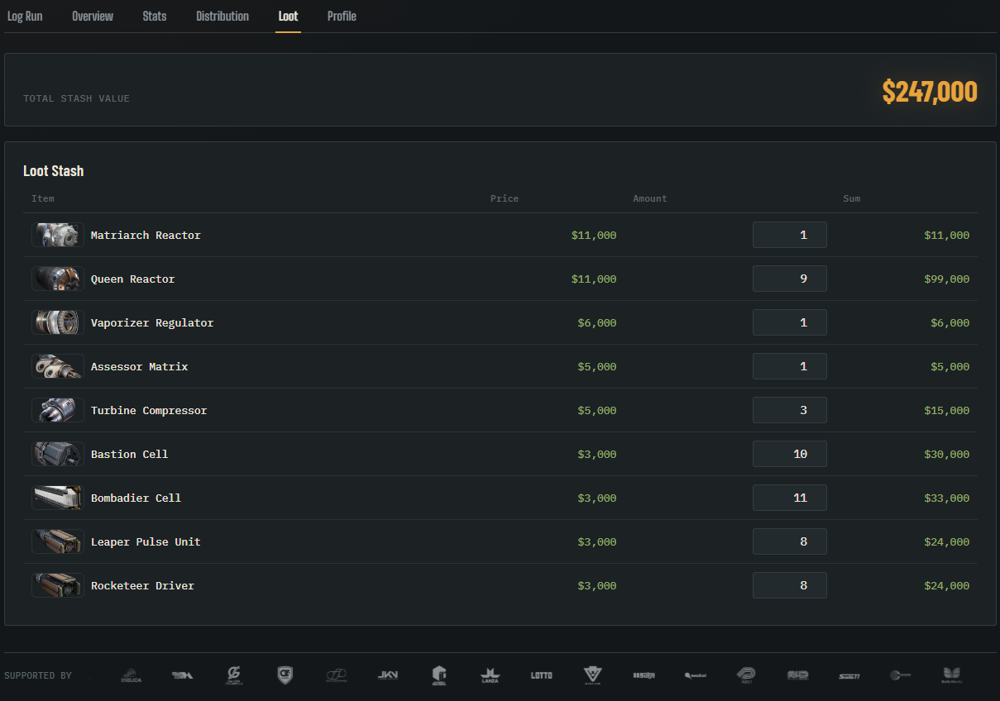

<p align="middle">
  <a href="https://nodejs.org" target="_blank">
    
  </a>
  <a href="https://nginx.org" target="_blank">
    
  </a>
  <a href="LICENSE" target="_blank">
    
  </a>
  <a href="web/fonts/OFL.txt" target="_blank">
    
  </a>
</p>

---
# ARC LOG — Match Tracker for Arc Raiders


Self-hosted web app for tracking Arc Raiders rounds (map, condition, currency, and XP), your loot stash value, and your Trials rank — with analytics broken down by map, map condition, and month, and an optional live Steam profile card.

**Docker Compose stack:**

- nginx (frontend, self-hosted fonts)
- Express API
- PostgreSQL

---

# Table of contents
- [ARC LOG — Match Tracker for Arc Raiders](#arc-log--match-tracker-for-arc-raiders)
- [Table of contents](#table-of-contents)
  - [Repository details](#repository-details)
    - [Folder structure](#folder-structure)
  - [Quick Start](#quick-start)
    - [First start](#first-start)
    - [Environment variables](#environment-variables)
  - [Architecture](#architecture)
  - [API](#api)
  - [Steam Integration](#steam-integration)
  - [Images](#images)
    - [Naming convention](#naming-convention)
  - [Backing Up Data](#backing-up-data)
  - [Updating](#updating)
  - [Versioning \& Releases](#versioning--releases)
  - [Features](#features)
  - [Screenshots](#screenshots)
    - [Log a run](#log-a-run)
    - [Stats](#stats)
    - [Distribution (Map / Condition)](#distribution-map--condition)
    - [Loot Tracker](#loot-tracker)
  - [License](#license)

---

## Repository details

Clone the repository to your **docker host**, e.g. into `/opt/docker/arc-raiders-salvage-log`

```bash
cd /opt/docker/

mkdir -p arc-raiders-salvage-log

git clone https://github.com/JCSimon1/arc-raiders-salvage-log.git

cd arc-raiders-salvage-log

cp .env.example .env
# Edit .env (POSTGRES_PASSWORD, WEB_PORT, ...) to your preferences
```

### Folder structure

```bash
arc-raiders-salvage-log/
├── api
│   ├── Dockerfile
│   ├── package.json
│   └── server.js
├── docs
│   ├── screenshots
│   └── api.md
├── web
│   ├── Dockerfile
│   ├── fonts
│   │   ├── OFL.txt          # licenses for all bundled fonts, see "License"
│   │   └── *.woff2
│   ├── fonts.css
│   ├── i18n.js               # DE / EN translations
│   ├── index.html
│   ├── nginx.conf
│   └── style.css
├── .env.example
├── docker-compose.yml
└── update.sh
```

The structure above only contains files needed to build and run the containers. Documentation lives in `/docs/`.

---
## Quick Start

### First start

```bash
chmod +x update.sh
./update.sh
```

Or alternatively, do it manually:

```bash
export APP_VERSION=$(git describe --tags --always)
docker compose up -d --build
```

The app will then be accessible at `http://localhost:8080` (or the port specified in the `WEB_PORT` environment variable).

### Environment variables

Configured via `.env` (copy from `.env.example`):

| Variable | Required | Description |
| -------- | -------- | ----------- |
| `POSTGRES_PASSWORD` | Recommended | Password for the `arclog` Postgres user/database. Defaults to `arclog` if unset. |
| `WEB_PORT` | No | Host port the app is exposed on. Defaults to `8080`. |
| `IMAGE_MOUNT` | No | Host path mounted read-only into the web container at `/usr/share/nginx/html/images`. Should contain `conditions/`, `maps/`, `ranks/`, `companies/` and `misc/` subfolders. Defaults to `./images`. |
| `STEAM_API_KEY` | No | Your Steam Web API key from the [Steam dev portal](https://steamcommunity.com/dev/apikey). Enables the Steam profile card. |
| `STEAM_ID` | No | Your 64-bit SteamID (steamID64), retrievable via [steamid.io](https://steamid.io). Required together with `STEAM_API_KEY`. |

---
## Architecture

Functionality of the docker containers:

| Container | Description |
| -------- | -------- |
| `api` | Node/Express API; talks to Postgres and, if configured, the Steam Web API |
| `db` | `postgres:16-alpine`, data persisted in the `db_data` volume |
| `web` | nginx, serves the static frontend (self-hosted fonts, no external font requests) and proxies `/api/` requests to the API |

All three services run with healthchecks, capped CPU/memory (`deploy.resources`), and rotating JSON logs (10 MB × 3 files) defined in `docker-compose.yml`.

---
## API

See [docs/api.md](docs/api.md) for the complete API reference (rounds, loot stash, settings/rank, Steam profile).

---
## Steam Integration

If both `STEAM_API_KEY` and `STEAM_ID` are set, the API calls the Steam Web API (`GetPlayerSummaries`) on your behalf and exposes a reduced `/api/steam/profile` endpoint (name, avatar, online status). The key itself never reaches the browser and results are cached server-side for 5 minutes. Without these variables set, the Steam profile card simply stays hidden.

---
## Images

You can supply your own images for maps, conditions, ranks and sponsor logos. Add them as `.webp` files under the respective subfolder of your image mount (`IMAGE_MOUNT`, default `./images`).

### Naming convention

* **Conditions** — `images/conditions/`
  * Use the actual condition name without spaces, e.g. `prospectingprobes.webp`.
  * If no image is found, only the condition name is displayed.
* **Maps** — `images/maps/`
  * Use the actual map name without spaces, e.g. `stellamontis.webp`.
  * If no image is found, only the map name is displayed.
* **Trials ranks** — `images/ranks/`
  * File name must match the rank's internal key (e.g. `rookie1.webp`, `hotshot.webp`, `cantinalegend.webp`); used on the Settings page and the profile rank card.
  * If no image is found for a selected rank, only the rank name is displayed.
* **Companies** — `images/companies/`
  * Sponsor/company logos shown in the marquee ticker at the bottom of the page.
  * If no logos are present, the ticker is not displayed.
* **Misc** — `images/misc/`
  * Currently used for `icon_skull.webp`, shown on runs logged with $0 earned ("deaths").

---

## Backing Up Data

```bash
docker compose exec db pg_dump -U arclog arclog > backup.sql
```
---
## Updating

Execute the update script:
```bash
./update.sh
```

The script pulls the latest changes, determines the current version number based on the Git tag, and rebuilds the containers.

---
## Versioning & Releases

The version number shown in the footer is derived from the current Git tag (`git describe --tags --always`) at **build time**, via the `APP_VERSION` build arg in `web/Dockerfile`.

To tag a new release:

```bash
git tag -a x.y.z -m "Description of the commit"
git push origin x.y.z
```

Pushing a tag matching `v*.*.*` also triggers the `Release` GitHub Actions workflow (`.github/workflows/release.yml`), which:
1. Injects the tag name into `web/index.html` directly (independent of the Docker build).
2. Packages the repository into a `arc-log-<tag>.zip` archive.
3. Publishes a GitHub Release with that archive and auto-generated release notes.

---

## Features

- Log a run / round, incl. edit and delete
- Overview of recent runs and a full, filterable, paginated run list (by map, condition, month)
- Automatic death tracking (a run logged with $0 earned is flagged as a death)
- Statistics
  - No. of rounds, deaths, total/avg. $ earned, total/avg. XP
  - Top 5 highscores by money and by XP
  - Diagrams: by Map, by Condition, Monthly
- Distribution view: rounds per map and per condition (donut charts)
- Loot Stash: track owned quantities of key crafting materials with live total value
- Round Report: an animated per-run summary card (with a "Top Run" stamp) opened from any run row
- Profile: pick your current Trials rank, optionally shown alongside a live Steam status card
- Language support for English and German
- Self-hosted fonts (Barlow, Barlow Condensed, JetBrains Mono, Big Shoulders, Prompt) — no external font requests
- Healthchecks and resource limits for all containers
- Automatic version footer via Git tags, with a tag-triggered GitHub release workflow
- Fun: sponsor logo marquee ticker

--- 
## Screenshots

Screenshots include local images that are not part of the repository. Those can be added to the respective `/images` subfolders following the [Naming convention](#naming-convention).

### Log a run


### Stats


### Distribution (Map / Condition)


### Loot Tracker


---
## License

The code in this repository is licensed under **MIT** (see [LICENSE](LICENSE)).

The fonts bundled under `web/fonts/` and loaded via `web/fonts.css` are **not** covered by the MIT license — they are distributed separately under the **SIL Open Font License, Version 1.1**. Full license text and copyright holders: [web/fonts/OFL.txt](web/fonts/OFL.txt).

| Font family | Copyright |
| ----------- | --------- |
| Barlow, Barlow Condensed | © 2017 The Barlow Project Authors |
| Big Shoulders | © 2019 The Big Shoulders Project Authors |
| JetBrains Mono | © 2020 The JetBrains Mono Project Authors |
| IBM Plex Mono | © 2017 IBM Corp. All rights reserved |
| IBM Plex Sans | © 2019 IBM Corp. All rights reserved |
| Prompt | © 2015 Cadson Demak |

Per the OFL, these fonts may be used, embedded and redistributed (including as part of this project) but may not be sold on their own, and any modified version must remain under the OFL. Documents/pages produced *with* the fonts (i.e. the app itself) are not required to be OFL-licensed — only the font files themselves.