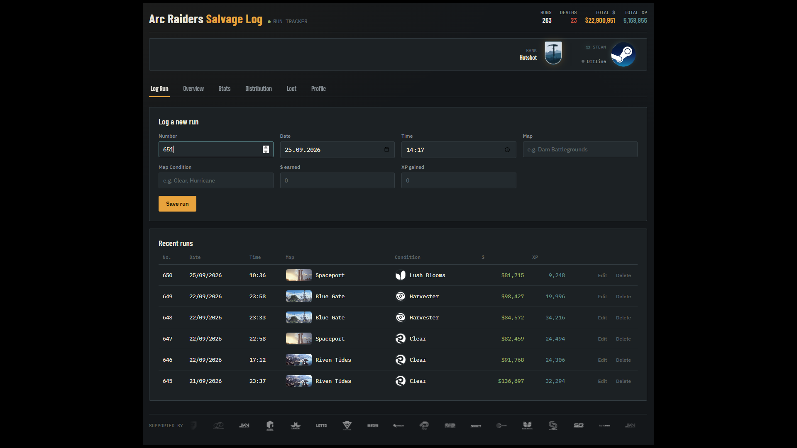
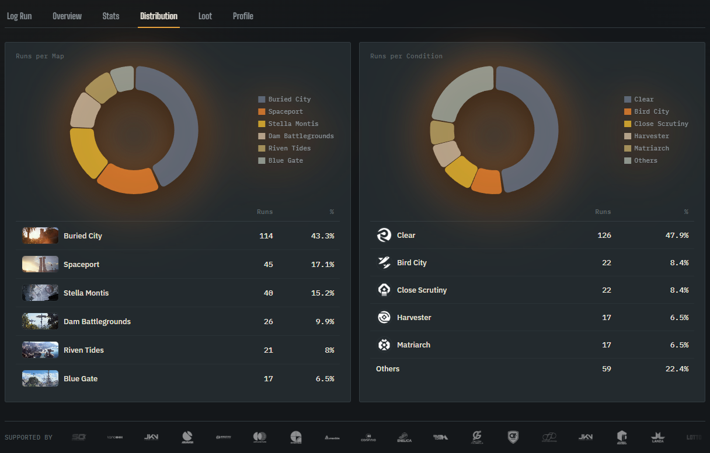
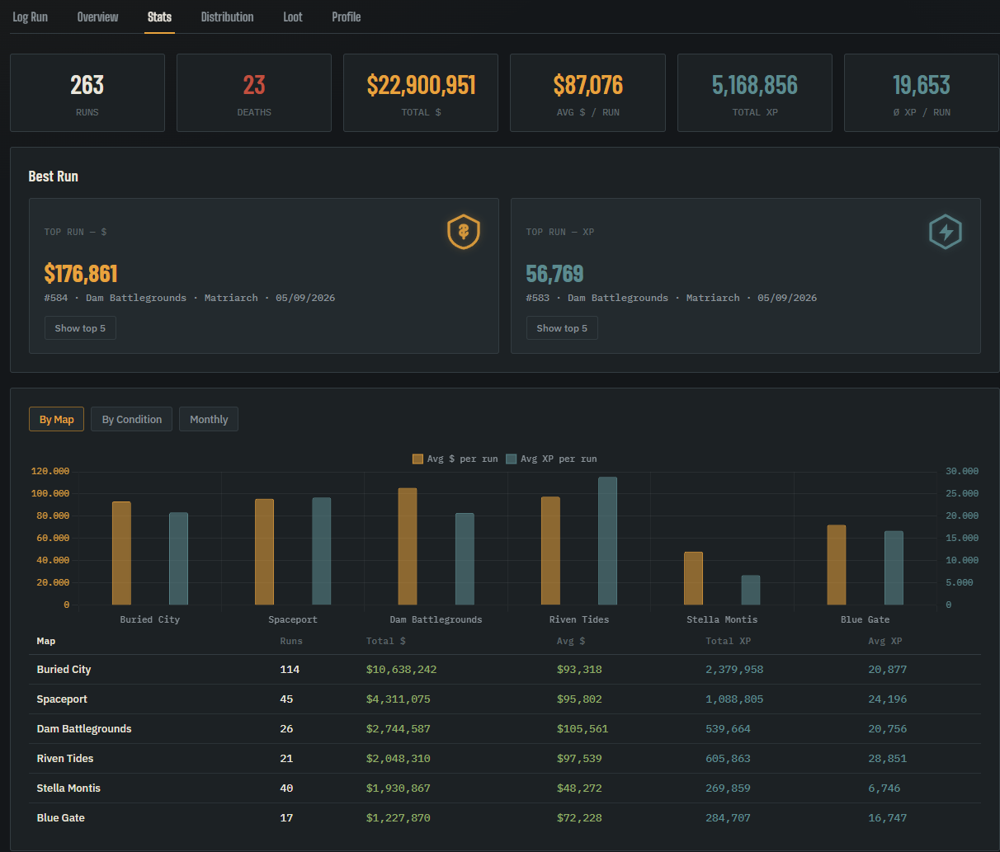

<p align="middle">
  <a href="https://nodejs.org" target="_blank">
    
  </a>
  <a href="https://nginx.org" target="_blank">
    
  </a>
  <a href="LICENSE" target="_blank">
    
  </a>
</p>


# ARC LOG — Match Tracker for Arc Raiders

Self-hosted simple web app for tracking Arc Raiders matches (map, condition, currency, and XP)
with analytics broken down by map, map condition, and month.

**Stack:** nginx (frontend) → Express API → PostgreSQL, all via Docker Compose.

## Repository details

Clone the repository to your **docker host**, e.g. into `/opt/docker/arc-raiders-salvage-log`

```bash
cd /opt/docker/

mkdir -p arc-raiders-salvage-log

git clone https://github.com/JCSimon1/arc-raiders-salvage-log.git

cd arc-raiders-salvage-log

cp .env.example .env
# Edit .env (POSTGRES_PASSWORD, WEB_PORT) to your preferences
```

### Folder structure

```bash
arc-raiders-salvage-log/
├── docker-compose.yml
├── .env
├── api/
│   ├── Dockerfile
│   ├── package.json
│   └── server.js
└── web/
    ├── Dockerfile
    ├── nginx.conf
    └── index.html
```

## Quick Start

```bash
docker compose up -d --build
```

The app will then be accessible at `http://localhost:8080` (or the port specified in environment variable `WEB_PORT`).

## Architecture

```
web/   → nginx, serves the frontend and proxies /api/ requests to the API
api/   → Node/Express API, communicates with Postgres
db     → postgres:16-alpine, data stored in the "db_data" volume
```

## Backing Up Data

```bash
docker compose exec db pg_dump -U arclog arclog > backup.sql
```

## Updating

```bash
git pull
docker compose up -d --build
```

## Features

- Log a run / round
- Overview of last runs
- Show statistics
  - No. of rounds, total/avg. $ earned, total XP
  - Best rounds ($ earned / XP earned)
  - Diagrams
    - By Map
    - By Condition
    - Monthly
- Language support for English and German

## Screenshots
### Log a run


### Overview


### Stats



## License

MIT; see [LICENSE](LICENSE).
